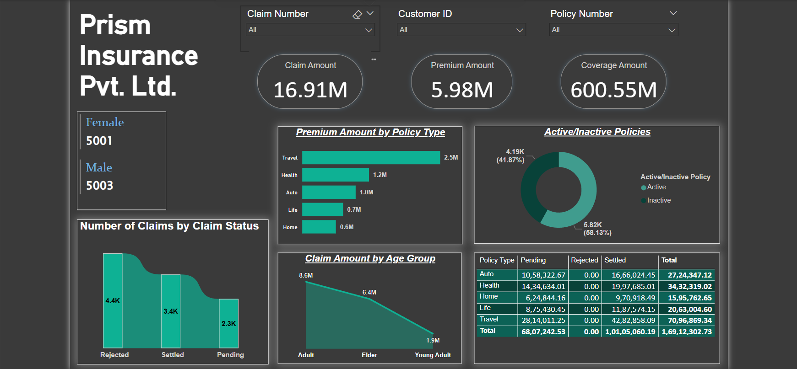

# 📊 Data Analytics Power BI Project - Insurance Data Analysis

This project presents a complete **Insurance Data Dashboard** built in **Power BI**, analyzing claims, premiums, policies, and customer distribution. It utilizes DAX for custom KPIs and provides a detailed drill-down for financial insights and user interactions.

---

## 💼 What I did in this project :

### 1. Data Connection
- Imported insurance claim and policy data into Power BI from Excel.

### 2. Data Cleaning
- Corrected data types for dates, numbers, and categorical fields.
- Removed missing, duplicate, or inconsistent records.

### 3. Data Modeling
- Built relationships between **Customer ID**, **Policy Number**, and **Claim Number**.
- Added new calculated columns (e.g., Claim Status categorization).

### 4. KPI Cards
- Displayed major highlights:
  - **Claim Amount**: ₹16.91M
  - **Premium Amount**: ₹5.98M
  - **Coverage Amount**: ₹600.55M

### 5. Filter Options (Slicers)
- Made it interactive with filters for Claim Number, Customer ID, and Policy Number.

### 6. Gender Distribution
- Showed a comparison between:
  - **Male**: 5003 customers
  - **Female**: 5001 customers

### 7. Visualizations Added
- 📊 Bar Chart: Premium Amount by Policy Type (Travel, Health, Auto, etc.)
- 📈 Line Graph: Claim Amount by Age Group (Adult, Elder, Young Adult)
- 🍩 Donut Chart: Active vs Inactive Policies
- 📉 Bar Chart: Number of Claims by Claim Status (Rejected, Settled, Pending)

### 8. Financial Summary Table
- Added a matrix table showing Pending, Rejected, and Settled amounts across different Policy Types.

### 9. Detailed Drill-Down Table (Next Page)
- Created a fully **drillable table** where users can explore detailed data from any visualization selection.
- Provides hierarchical deep-dives into policy details, claims, and customer information.

### 10. Theme & Styling
- Used a dark modern theme for better focus on numbers.
- Added clear titles, labels, and subtle borders around visuals.

---

[Click to see Project's Video / LinkedIn Post](https://www.linkedin.com/posts/zodrick-john-1689a8256_powerbi-insuranceanalysis-businessintelligence-activity-7322194127863906304-saaa?utm_source=share&utm_medium=member_desktop&rcm=ACoAAD8mrOABsUmTOAKWlhdQdbjigs27IxTaqzA)

---

## 🛠 Tools & Features Used
- **Power BI Desktop**
- **Power Query** for data cleaning
- **DAX** for calculated columns and KPIs
- **Interactive Visuals**: KPI Cards, Bar Charts, Donut Charts, Line Graphs, Drill-Down Table
- **Slicers and Drill-Through Reports**
- **Professional Dashboard Design**

---

## 🔥 Skills Demonstrated
- Power BI (Intermediate to Advanced)
- Data Cleaning & Modelling
- Financial and Insurance Data Analysis
- KPI Tracking
- Dashboard Storytelling
- Drill-Down and Interactive Reporting
- UI/UX Designing in BI Dashboards

---

